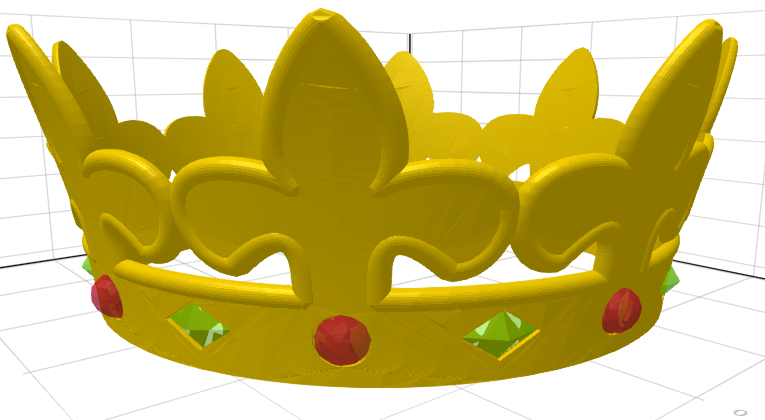

# ConstructiveGeometry

Defining CSG objects from within Julia.

`ConstructiveGeometry.jl` provides functions for defining 2d shapes
and 3d solids via basic primitives and CSG operations, as well as
functions for displaying these objects and output to SVG or STL files.

It is possible to use this module to define basic 3d models.
Examples are included in the [examples subdirectory](examples/):
 - ;
 - ;
The images were rendered by the `CairoMakie` back-end.
It is also possible to export a model as a `.svg` (for 2d shapes)
or `.stl` (for 3d volumes) file.

The following features should be mostly working now:
 - 2d shapes: square, circle, polygon, path stroke;
 - 3d shapes: cube, sphere, cylinder, cone, explicit surface;
 - boolean operations, linear transformations;
 - 2d->3d extrusions (linear, cone, revolution, curvilinear);
 - 3d->2d projection and slicing;
 - convex hull and Minkowski sum (2d, 3d, mixed dimensions);
 - offset (2d and 3d);
 - surface decimation, refining, and Loop subdivision;
 - volume deformation using user-supplied functions;
 - import from STL and PLY, and export to STL, PLY and SVG.

## Global philosophy

This package defines both a structure for abstract­geometric objects
and a way to convert such “ideal” objects to concrete meshes.
These meshes are implemented as triangulated surfaces
using the IGL graphics library.

## Why write this when OpenSCAD exists?

Our goal is to replicate what OpenSCAD proved works well
(a simple syntax for script-based CAD)
while fixing some of the less-fun parts.

We believe that using Julia provides the following advantages:
 - a more complete (and easier to use) programming language
   (e.g. a language which natively contains linear algebra is easier to
   use for constraint-based design);
 - the ability to link external libraries (e.g. defining surfaces as
   solutions of differential equations or least-square fits);
 - giving the user access to the internal representation of all 3d models
   (whereas OpenSCAD's modules are closed) for e.g. implementing custom
   deformations;
 - ease of extending the basic functions of the library (e.g. ultimately
   implementing Minkowski difference or swung volumes should not be too
   hard, and some form of splines should be possible too), whereas such
   attempts in OpenSCAD often lead to “rewriting OpenSCAD in OpenSCAD”;
 - file I/O is easier to implement (and in more formats);
 - IGL's triangulated surfaces are likely faster (and more adapted to
   CAD) than CGAL's Nef polyedra, although this package has not reached
   the “speed benchmarks” phase yet.

On the other hand, one notable drawback of Julia (in particular with many
dependencies) is the long “time-to-first-plot”. Once everything is loaded
however, the second, third plots etc. are much faster.

Reaching feature-parity (at least for static designs)
is one of the first goals of this package.
The main missing part for this is the primitive `text`.
On the other hand, this package already provides a few constructions
absent from (base) OpenSCAD, such as 3d offsetting or surface sweep.

## Future goals

Once this feature parity is achieved, we plan to move on to
include more content (e.g. some of what is usually implemented
library-side in OpenSCAD), such as:
 - add an annotation system to ease the design of complex models;
 - add an anchor system;
 - use splines and NURBs to define models.

## Libraries used

Currently (as of 2021-08), `ConstructiveGeometry.jl` happily uses
the following libraries:
 - [`libigl`](https://libigl.github.io/) for 3d mesh operations;
 - [`Clipper`](https://github.com/JuliaGeometry/Clipper.jl) for polygon operations;
 - [`Makie`](https://github.com/JuliaPlots/Makie.jl) for visualization;
 - [`Triangle`](https://cvdlab.github.io/Triangle.jl/) for triangulation;
 - [`Polyhedra`](https://github.com/JuliaPolyhedra/Polyhedra.jl) and [`GLPK`](https://github.com/jump-dev/GLPK.jl) for convex hull.

## Joining the project

This project is currently still at the “one-person effort” stage,
although it is not indended that it remain here. There are multiple parts
which could use some help; apart from the Todo-list above, even something
as simple as playtesting the project would be appreciable help.
