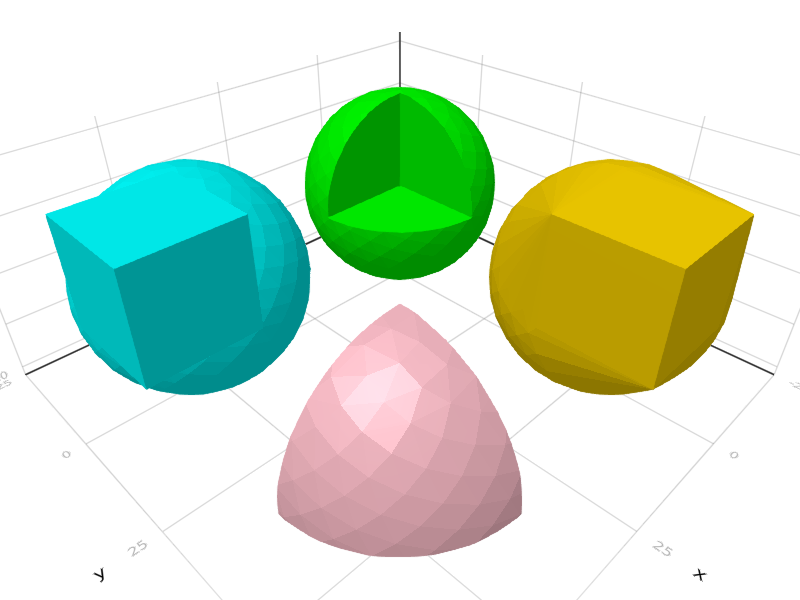

# ConstructiveGeometry

Defining CSG objects from within Julia.

`ConstructiveGeometry.jl` provides functions for defining 2d shapes
and 3d solids via basic primitives and CSG operations, as well as
functions for displaying these objects and output to SVG or STL files.

It is possible to use this module to define basic 3d models: namely,
the following image is the result of [this short
file](examples/sphere_cube.jl):

The images were rendered by the `CairoMakie` back-end.
It is also possible to export a model as a `.svg` (for 2d shapes)
or `.stl` (for 3d volumes) file.

The following features should be mostly working now:
 - 2d shapes: square, circle, polygon, path stroke;
 - 3d shapes: cube, sphere, cylinder, cone, explicit surface;
 - boolean operations, linear transformations;
 - 2d->3d extrusions (linear, revolution, curvilinear);
 - 3d->2d projection and slicing;
 - 2d Minkowski sum and offset;
 - 3d offset (partly) and surface decimation.

## Libraries used

Currently (as of 2021-08), `ConstructiveGeometry.jl` happily uses
the following libraries:
 - [`libigl`](https://libigl.github.io/) for 3d mesh operations;
 - [`Clipper`](https://github.com/JuliaGeometry/Clipper.jl) for polygon operations;
 - [`Makie`](https://github.com/JuliaPlots/Makie.jl) for visualization;
 - [`Triangle`](https://cvdlab.github.io/Triangle.jl/) for triangulation;
 - [`Polyhedra`](https://github.com/JuliaPolyhedra/Polyhedra.jl) and [`GLPK`](https://github.com/jump-dev/GLPK.jl) for convex hull.

The roadmap now includes at least the following:
 - `.stl` file import, and I/O to more formats;
   path extrusion; `text()`;
 - add an annotation system to ease the design of complex models;
 - add an anchor system.

## Why write this when OpenSCAD exists?

Our goal is to replicate what OpenSCAD proved works well
(a simple syntax for script-based CAD),
while fixing some less-fun parts
(which include at least the esoteric programming language and the
“opaque” data types for geometric objects).

One of the main differences (and, we believe, advantages) this has over
OpenSCAD is that all meshes are accessible to the end-user,
thus making 

Any contributions are welcome!
